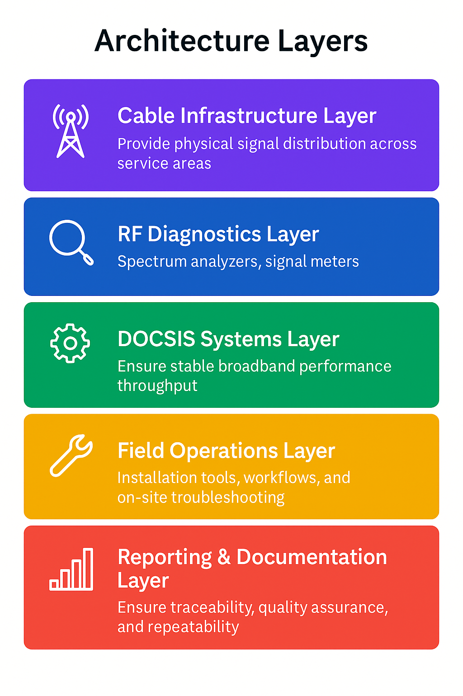

# 🌐 Charter Communications – Network Field Engineer
**Cable Infrastructure • DOCSIS Optimization • RF Analysis • Field Operations**

## 📌 Overview

Hands-on field engineering role focused on installing, tuning, and modernizing cable infrastructure. Delivered upgrades and service improvements that directly impacted customer satisfaction and operational efficiency.

This position demonstrated expertise in **RF engineering, DOCSIS systems, field troubleshooting, and team leadership** in a fast-paced telecommunications environment.

**Duration**: 2017–2019

## 🎯 Responsibilities & Scope

- Led cable infrastructure installation and optimization across multiple sites
- Performed RF analysis and signal tuning for optimal network performance
- Managed 300+ monthly service calls with industry-leading resolution rates
- Delivered major infrastructure modernization projects
- Trained and mentored junior field engineers
- Ensured compliance with Charter's operational and safety standards

## 🛠️ Tools & Technologies

### **Technology Stack**

<table>
<thead>
<tr>
<th>Category</th>
<th>Technologies</th>
<th>Purpose</th>
</tr>
</thead>
<tbody>
<tr>
<td><strong>📡 Network Standards</strong></td>
<td>DOCSIS optimization<br>RF spectrum analysis</td>
<td>Cable modem and signal quality management</td>
</tr>
<tr>
<td><strong>🔧 Field Equipment</strong></td>
<td>Signal meters<br>RF testing tools<br>Cable installation equipment</td>
<td>Infrastructure deployment and diagnostics</td>
</tr>
<tr>
<td><strong>📊 Analysis</strong></td>
<td>RF analysis tools<br>Signal tuning software</td>
<td>Performance optimization and troubleshooting</td>
</tr>
<tr>
<td><strong>⚙️ Automation</strong></td>
<td>Bash scripting<br>Diagnostic scripts</td>
<td>Signal checks and automated testing</td>
</tr>
<tr>
<td><strong>📋 Operations</strong></td>
<td>Field troubleshooting workflows<br>Installation procedures</td>
<td>Service delivery and quality assurance</td>
</tr>
</tbody>
</table>

────────────────────────────────────────────────────────────────────────────────

## 🧠 System Summary

This repository showcases field engineering work focused on cable infrastructure, DOCSIS optimization, and RF diagnostics within Charter Communications’ broadband network.  
It includes sanitized workflows, diagnostic scripts, and documentation from hands‑on service delivery across multiple service areas.

## 🚀 Why This Work Matters

Reliable broadband service depends on precise signal tuning, proactive diagnostics, and scalable field workflows.  
This work directly improved customer satisfaction, reduced repeat service calls, and modernized aging infrastructure across Charter’s network footprint.

By standardizing DOCSIS optimization and RF troubleshooting, this system enabled faster resolution, stronger team capability, and measurable service quality improvements.

────────────────────────────────────────────────────────────────────────────────

## 🧩 Architecture Overview
```
+---------------------------+
|   Customer Report Issue   |
+-------------+-------------+
              |
              v
+---------------------------+
|   Field Assessment        |
| Signal levels • Noise     |
+-------------+-------------+
              |
              v
+---------------------------+
|   RF Diagnostics          |
| Spectrum analysis         |
+-------------+-------------+
              |
              v
+---------------------------+
|   Signal Optimization     |
| Tuning • Installation     |
+-------------+-------------+
              |
              v
+---------------------------+
|   Validation & Testing    |
| Quality check • Metrics   |
+---------------------------+
```

### 📷 Visual Architecture Diagram (PNG)



## 🧩 Architecture Layers

| Layer | Components | Function |
|-------|------------|----------|
| 📡 Cable Infrastructure Layer | Coax plant, amplifiers, taps, splitters | Provides physical signal distribution across service areas |
| 🔍 RF Diagnostics Layer | Spectrum analyzers, signal meters | Identifies noise, interference, and signal degradation |
| ⚙️ DOCSIS Systems Layer | Modems, CMTS interactions, DOCSIS tuning | Ensures stable broadband performance and throughput |
| 🛠️ Field Operations Layer | Installation tools, workflows, SOPs | Supports reliable service delivery and on‑site troubleshooting |
| 📊 Reporting & Documentation Layer | Field logs, tuning reports, service records | Ensures traceability, quality assurance, and repeatability |

## 📊 Metrics Analyzed

| Metric Category | Purpose | Examples |
|-----------------|----------|----------|
| 📡 RF Performance Metrics | Validate signal health and noise levels | SNR, MER, upstream/downstream power |
| ⚙️ DOCSIS Metrics | Ensure modem stability and throughput | Correctables/uncorrectables, ranging, channel bonding |
| 🛠️ Field Operations Metrics | Improve service delivery and reduce repeat calls | First‑attempt resolution, call volume, escalation rate |
| 📊 Infrastructure Health | Track plant reliability and upgrade impact | Amplifier performance, node health, noise sources |
| 😊 Customer Experience Metrics | Measure service quality improvements | Resolution time, satisfaction indicators |

────────────────────────────────────────────────────────────────────────────────

## 🔐 Authentication Workflow
*(Renamed for Charter as “Field Service Workflow” — same structural slot)*

| Step | Action | Purpose |
|------|--------|----------|
| 1 | Receive customer issue and validate symptoms | Establish baseline understanding |
| 2 | Perform RF and DOCSIS diagnostics | Identify noise, interference, or signal loss |
| 3 | Inspect physical infrastructure | Locate damaged cables, connectors, or plant components |
| 4 | Apply corrective actions and tune signal levels | Restore optimal performance |
| 5 | Validate improvements with RF and DOCSIS metrics | Confirm stability and service quality |
| 6 | Document findings and close service record | Ensure traceability and future reference |

•••••••••••••••

## 🔧 Technical Workflows

### 📡 DOCSIS Optimization Process

| Step | Action | Tools Used |
|------|--------|------------|
| 1 | Assess current signal levels and quality metrics | RF meters, DOCSIS diagnostics |
| 2 | Identify noise sources and signal degradation | Spectrum analyzers |
| 3 | Tune amplifiers and adjust signal levels | Field equipment |
| 4 | Validate improvements with signal testing | Signal meters |
| 5 | Document baseline and final metrics | Field reports |

•••••••••••••••

## 🔧 Common Troubleshooting Scenarios

| Issue Type | Symptoms | Resolution |
|------------|----------|------------|
| 📡 Low Signal Levels | Slow speeds, modem drops | Adjust amplifiers, replace connectors, rebalance plant |
| 🔍 Noise / Ingress | Fluctuating SNR, intermittent service | Identify interference source, repair or isolate |
| ⚙️ DOCSIS Sync Issues | Modem not bonding channels | Re‑tune upstream/downstream levels, inspect cabling |
| 🛠️ Physical Damage | No service, severe degradation | Replace damaged coax, splitters, or taps |
| 📊 Customer‑Reported Intermittency | Random drops, inconsistent performance | Perform full RF analysis and validate with diagnostics |

────────────────────────────────────────────────────────────────────────────────

## 🚀 Deployment Workflow
*(Renamed for Charter as “Infrastructure Deployment Workflow” — same structural slot)*

| Step | Action | Purpose |
|------|--------|----------|
| 1 | Assess existing cable plant | Identify upgrade requirements |
| 2 | Install or replace amplifiers, taps, and splitters | Improve physical layer reliability |
| 3 | Perform RF alignment and signal tuning | Optimize downstream/upstream performance |
| 4 | Validate improvements using diagnostics | Confirm SNR, MER, and power levels |
| 5 | Document installation details | Maintain traceability and support future work |
| 6 | Handoff to operations teams | Ensure continuity and readiness |

•••••••••••••••

## ✅ Key Outcomes

| Outcome | Description |
|---------|-------------|
| 📈 Improved Service Reliability | Reduced noise, better signal levels, fewer outages |
| ⚙️ Stabilized DOCSIS Performance | Consistent throughput and channel bonding |
| 🔧 Faster Troubleshooting | Standardized workflows reduced resolution time |
| 👥 Stronger Team Capability | Training and documentation improved field readiness |
| 💰 Infrastructure Modernization | Delivered $240K in upgrades across service areas |

•••••••••••••••

## 🚀 Key Achievements

<table>
<thead>
<tr>
<th>Metric</th>
<th>Achievement</th>
<th>Impact</th>
</tr>
</thead>
<tbody>
<tr>
<td><strong>💰 Revenue</strong></td>
<td>$240K in upgrades delivered</td>
<td>Infrastructure modernization projects across service areas</td>
</tr>
<tr>
<td><strong>✅ Resolution Rate</strong></td>
<td>95% first-attempt resolution</td>
<td>300+ monthly service calls resolved without escalation</td>
</tr>
<tr>
<td><strong>👥 Team Development</strong></td>
<td>Trained junior engineers</td>
<td>Improved team readiness and reduced escalations</td>
</tr>
<tr>
<td><strong>📈 Customer Satisfaction</strong></td>
<td>Increased through faster resolution</td>
<td>Standardized troubleshooting and quality service delivery</td>
</tr>
</tbody>
</table>

•••••••••••••••

## 🧩 Engineering Challenges Solved

| Area | Challenge | Outcome |
|------|-----------|---------|
| 📡 Signal Quality & Noise | Interference, ingress, and poor SNR impacting customer service | Improved signal levels and reduced noise through targeted RF tuning |
| ⚙️ DOCSIS Stability | Modem drops, speed inconsistencies, upstream noise | Standardized DOCSIS optimization workflows improving reliability |
| 🔧 Field Troubleshooting | High volume of complex service calls | Achieved 95% first‑attempt resolution across 300+ monthly calls |
| 🏗️ Infrastructure Modernization | Aging cable plant and outdated components | Delivered $240K in upgrades across multiple service areas |
| 👥 Team Capability | Junior engineers lacking structured training | Built training materials and hands‑on mentorship programs |

────────────────────────────────────────────────────────────────────────────────

## 🗂️ Repository Structure
```
Charter-Network-Engineering/
│
├── artifacts/
│   ├── DOCSIS-Tuning-Workflow.md        # Standard DOCSIS optimization workflow (sanitized)
│   └── RF-Analysis-Log-Sample.md        # Sample RF analysis documentation & metrics (sanitized)
│
├── scripts/
│   └── signal-check.sh                  # Automated signal quality validation script
│
└── README.md                            # Main project documentation
```
### 📁 Directory Descriptions

| Directory | Purpose |
|-----------|---------|
| `artifacts/` | DOCSIS tuning workflow, RF analysis samples, and field documentation |
| `scripts/` | Automated signal validation and diagnostic scripts |

•••••••••••••••

### 📄 Key Files

| File | Description |
|------|-------------|
| `artifacts/DOCSIS-Tuning-Workflow.md` | Standard operating procedure for DOCSIS optimization |
| `artifacts/RF-Analysis-Log-Sample.md` | Sample RF analysis documentation and metrics |
| `scripts/signal-check.sh` | Automated signal quality validation script |

────────────────────────────────────────────────────────────────────────────────

## 🔒 Confidentiality Notice

All documentation, workflows, and examples in this repository are fully sanitized.  
No proprietary configurations, customer data, or internal operational details from Charter Communications are included.

Content is provided solely for educational and portfolio demonstration purposes.
**Note**: All files contain sanitized, illustrative data for privacy and confidentiality.

## 📄 License

This repository contains sanitized, non‑sensitive documentation and workflows from field engineering experience at Charter Communications.  
All content is provided strictly for educational and portfolio demonstration purposes.

No proprietary configurations, customer data, or confidential operational details are included.

## 👔 Professional Context

**Suren Jewels**  
Senior Cloud Engineer | Infrastructure & Security Specialist

*For inquiries about this experience or collaboration opportunities, please reach out via LinkedIn.*

────────────────────────────────────────────────────────────────────────────────

